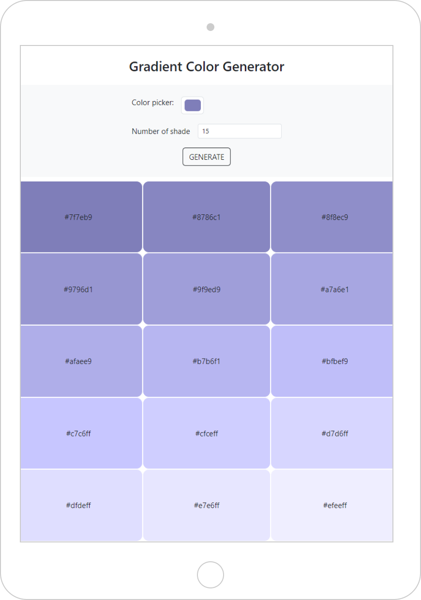

## Color Gradient
This is my fifth project made with <a href="https://react.dev/"> React </a>

 

📌AIM: **Develop a webpage with a form to create a list of color light gradient**
- the user choose a color and insert a number of shades
- by clicking a btn the form is activated 
- return a list of HEX colors
- by clicking on the text the color is copied 

 

   

 
